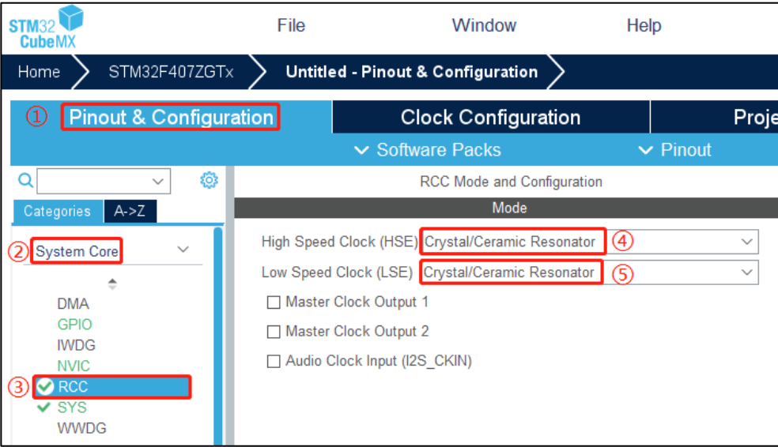
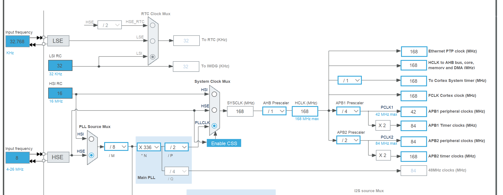
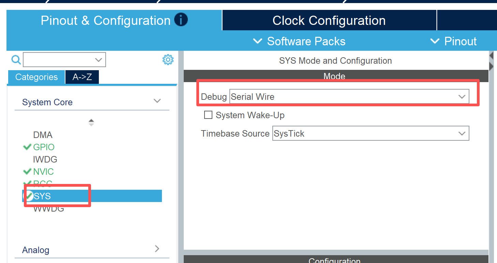
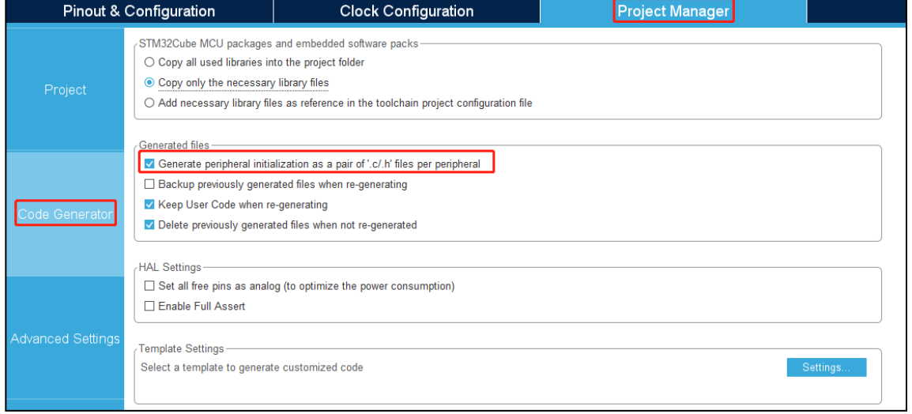
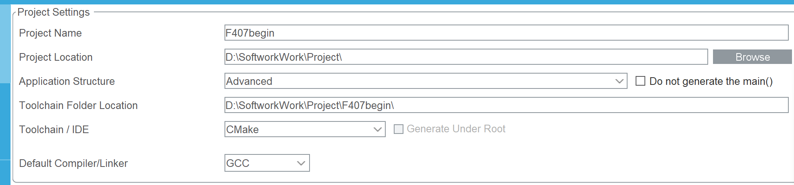
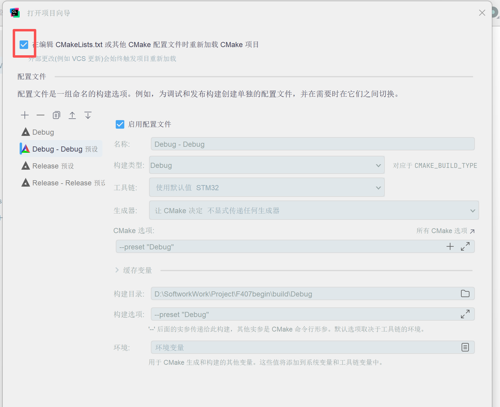
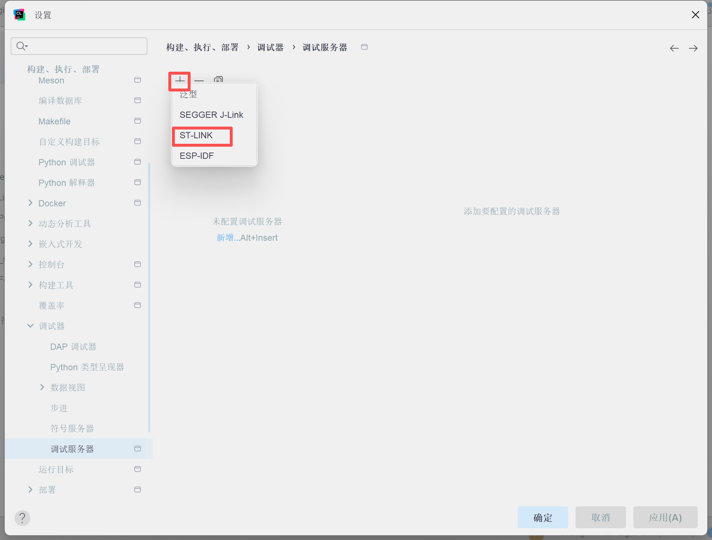
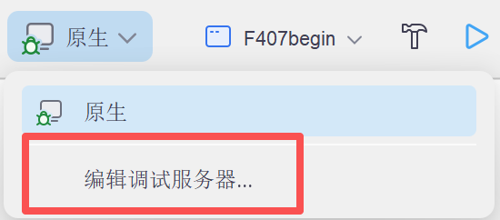
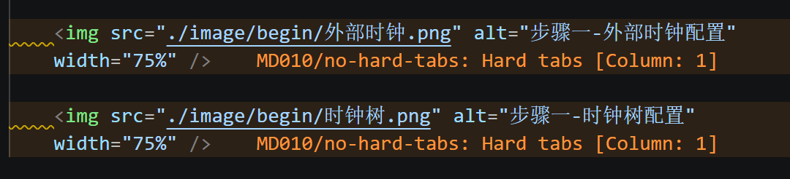

<h1 align="center">初始工程设计</h1>

## 目录

- [概述](#概述)
- [操作内容](#操作内容)
- [操作步骤目录](#操作步骤目录)
- [备注](#备注)

## 概述

- 从0完整的搭建一个可用工程

## 操作内容

### 操作步骤目录

- [目录](#目录)
- [概述](#概述)
- [操作内容](#操作内容)
  - [操作步骤目录](#操作步骤目录)
  - [步骤一：打开外部时钟、并配置时钟树](#步骤一打开外部时钟并配置时钟树)
  - [步骤二：添加烧录器接口](#步骤二添加烧录器接口)
  - [步骤三：生成单独的.c和.h文件](#步骤三生成单独的c和h文件)
  - [步骤四：选择cmake构建系统](#步骤四选择cmake构建系统)
  - [步骤五：clion打开工程时的配置](#步骤五clion打开工程时的配置)
- [备注](#备注)

### 步骤一：打开外部时钟、并配置时钟树

### 步骤二：添加烧录器接口

### 步骤三：生成单独的.c和.h文件

### 步骤四：选择cmake构建系统

### 步骤五：clion打开工程时的配置

## 备注

- 注意事项：本md文件不适配vscode的MD33语法规则，不会报错，但是大量警告影响阅读，操作步骤，在工程文件夹下新建.vscode/settings.json，写入忽略警告的语法，例如将图片中的MD010取消显示（让Ai补充所有警告）

