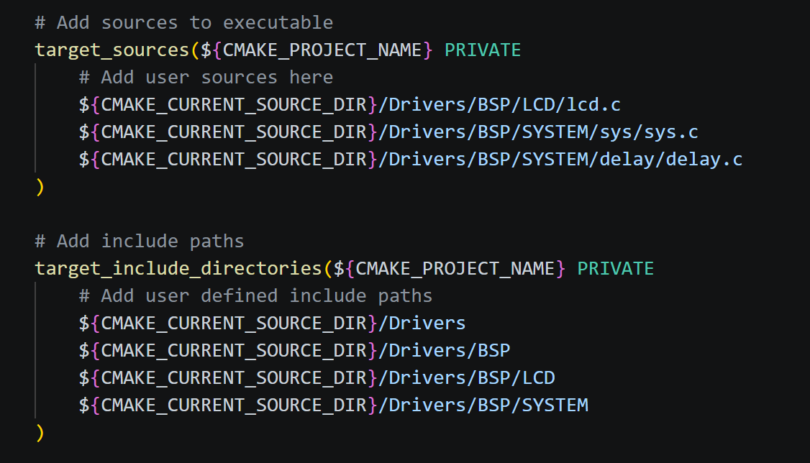
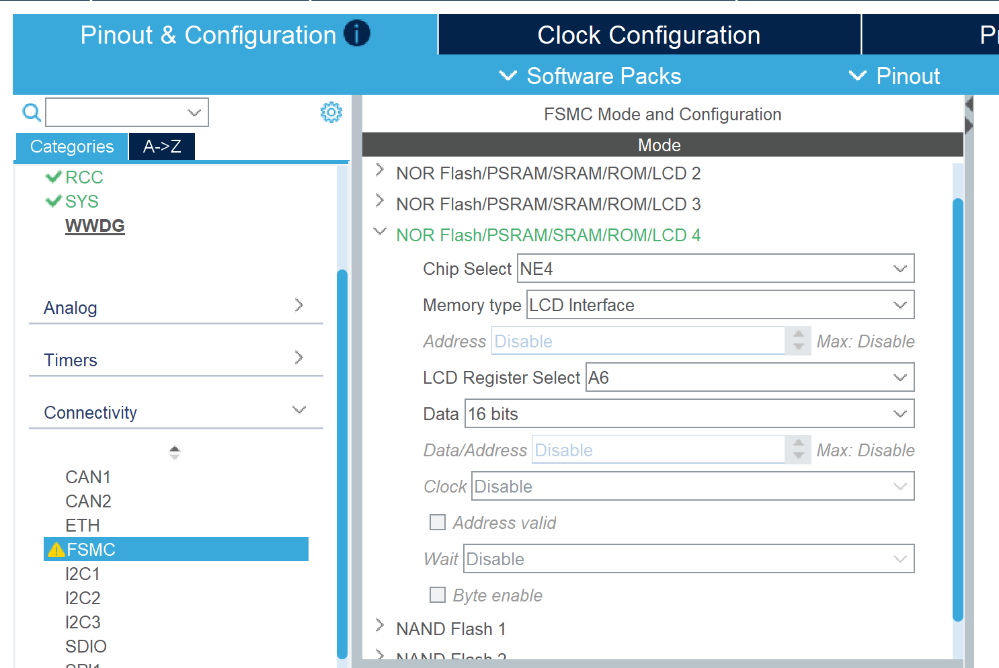
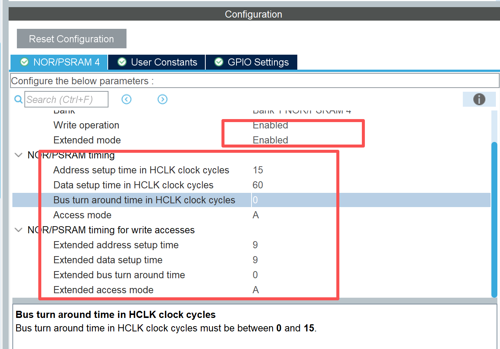

<h1 align="center">LCD使用</h1>

## 目录

- [目录](#目录)
- [概述](#概述)
- [操作内容](#操作内容)
  - [操作步骤目录](#操作步骤目录)
  - [步骤一：迁移LCD、TOUCH、SYSTEM文件夹](#步骤一迁移lcdtouchsystem文件夹)
  - [步骤二：修改cubemx的FSMC](#步骤二修改cubemx的fsmc)
  - [步骤三：修改lcd.c（直接复制此工程的lcd.c则跳过这步）](#步骤三修改lcdc直接复制此工程的lcdc则跳过这步)
  - [步骤四：main.c添加添加#include "lcd.h"、lcd\_init();和lcd\_clear(WHITE);](#步骤四mainc添加添加include-lcdhlcd_init和lcd_clearwhite)
- [备注](#备注)

## 概述

- 背景：
- 目标：
- 结果：

## 操作内容

### 操作步骤目录

- [目录](#目录)
- [概述](#概述)
- [操作内容](#操作内容)
  - [操作步骤目录](#操作步骤目录)
  - [步骤一：迁移LCD、TOUCH、SYSTEM文件夹](#步骤一迁移lcdtouchsystem文件夹)
  - [步骤二：修改cubemx的FSMC](#步骤二修改cubemx的fsmc)
  - [步骤三：修改lcd.c（直接复制此工程的lcd.c则跳过这步）](#步骤三修改lcdc直接复制此工程的lcdc则跳过这步)
  - [步骤四：main.c添加添加#include "lcd.h"、lcd\_init();和lcd\_clear(WHITE);](#步骤四mainc添加添加include-lcdhlcd_init和lcd_clearwhite)
- [备注](#备注)

### 步骤一：迁移LCD、TOUCH、SYSTEM文件夹
使用keil需要添加文件，这里不写；
使用cmake需要修改CMakeLists.txt文件，在45行左右找到# Add sources to executable

- 操作说明：

### 步骤二：修改cubemx的FSMC

- 操作说明：

### 步骤三：修改lcd.c（直接复制此工程的lcd.c则跳过这步）
注释掉lcd.c中32行#include "./SYSTEM/usart/usart.h"、788行printf和606行HAL_SRAM_MspInit(),前者需要占用uart（正常使用会打印屏幕型号），后者与cubemx中的FSMC配置冲突

- 操作说明：
- 

### 步骤四：main.c添加添加#include "lcd.h"、lcd_init();和lcd_clear(WHITE);

## 备注

- 注意事项：
- 图片建议统一放在 `./image/子目录/` 下，便于维护。
- 在屏幕显示内容的主要函数：

1. `lcd_init()`：初始化LCD，定义见 [Drivers/BSP/LCD/lcd.c](../../Drivers/BSP/LCD/lcd.c)（第637行）
2. `lcd_clear(color)`：整屏清屏，定义见 [Drivers/BSP/LCD/lcd.c](../../Drivers/BSP/LCD/lcd.c)（第855行）
3. `lcd_draw_point(x, y, color)`：画点，定义见 [Drivers/BSP/LCD/lcd.c](../../Drivers/BSP/LCD/lcd.c)（第426行）
4. `lcd_draw_line(x1, y1, x2, y2, color)`：画直线，定义见 [Drivers/BSP/LCD/lcd.c](../../Drivers/BSP/LCD/lcd.c)（第927行）
5. `lcd_draw_hline(x, y, len, color)`：画水平线，声明见 [Drivers/BSP/LCD/lcd.h](../../Drivers/BSP/LCD/lcd.h)（第224行）
6. `lcd_draw_rectangle(x1, y1, x2, y2, color)`：画矩形，定义见 [Drivers/BSP/LCD/lcd.c](../../Drivers/BSP/LCD/lcd.c)（第1018行）
7. `lcd_draw_circle(x0, y0, r, color)`：画圆，定义见 [Drivers/BSP/LCD/lcd.c](../../Drivers/BSP/LCD/lcd.c)（第1033行）
8. `lcd_fill_circle(x, y, r, color)`：画实心圆，定义见 [Drivers/BSP/LCD/lcd.c](../../Drivers/BSP/LCD/lcd.c)（第1074行）
9. `lcd_fill(sx, sy, ex, ey, color)`：纯色区域填充，声明见 [Drivers/BSP/LCD/lcd.h](../../Drivers/BSP/LCD/lcd.h)（第226行）
10. `lcd_color_fill(sx, sy, ex, ey, color_buf)`：彩色区域填充，声明见 [Drivers/BSP/LCD/lcd.h](../../Drivers/BSP/LCD/lcd.h)（第227行）
11. `lcd_show_char(x, y, chr, size, mode, color)`：显示单字符，定义见 [Drivers/BSP/LCD/lcd.c](../../Drivers/BSP/LCD/lcd.c)（第1112行）
12. `lcd_show_num(x, y, num, len, size, color)`：显示数字，定义见 [Drivers/BSP/LCD/lcd.c](../../Drivers/BSP/LCD/lcd.c)（第1207行）
13. `lcd_show_xnum(x, y, num, len, size, mode, color)`：扩展数字显示，声明见 [Drivers/BSP/LCD/lcd.h](../../Drivers/BSP/LCD/lcd.h)（第233行）
14. `lcd_show_string(x, y, width, height, size, str, color)`：显示字符串，定义见 [Drivers/BSP/LCD/lcd.c](../../Drivers/BSP/LCD/lcd.c)（第1290行）
15. `lcd_display_on()` / `lcd_display_off()`：开关显示，声明见 [Drivers/BSP/LCD/lcd.h](../../Drivers/BSP/LCD/lcd.h)（第210行）
16. `lcd_display_dir(dir)` / `lcd_scan_dir(dir)`：方向与扫描方式，声明见 [Drivers/BSP/LCD/lcd.h](../../Drivers/BSP/LCD/lcd.h)（第212行）

- 常用颜色宏跳转（CLion兼容）：

1. [WHITE](../../Drivers/BSP/LCD/lcd.h)（第159行）
2. [BLACK](../../Drivers/BSP/LCD/lcd.h)（第160行）
3. [RED](../../Drivers/BSP/LCD/lcd.h)（第161行）
4. [GREEN](../../Drivers/BSP/LCD/lcd.h)（第162行）
5. [BLUE](../../Drivers/BSP/LCD/lcd.h)（第163行）

